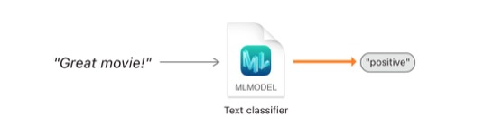
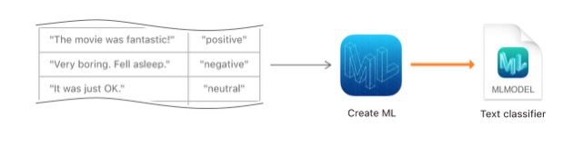

# 创建一个文本分类模型
> 训练一个机器学习模型去区分自然语言文本
## 概述
如图所示,text classifier就是一个被训练过的机器学习模型,用来识别自然语言的表达方式,如一个句子表达出来的情感.

<div align="center"></div>

你可以通过向模型提供大量的已经标记过的文本样例来训练它,例如,已经标记了积极的,消极的,中立的等标签的电影评论.
<div align="center"></div>

## 导入数据
首先,我们应该收集文本数据,并将它导入给一个`MLDataTable`实例.你可以创建一个JSON格式和CSV格式的数据表,或者,如果你的文本数据收集在文件中,你可以以文件夹的方式进行区分,用文件夹的名字作为标记,就像之前我们创建图片分类模型时用到的图片数据源一样.<br>
作为示例,我们可以创建一个JSON文件,其中包含我们已经根据情绪分好类的电影评论.每个条目都包含一对键,`text`和`label`.这些键的值就是用来训练模型的输入样本.如下所示:
```
[
    {
        "text": "The movie was fantastic!",
        "label": "positive"
    }, {
        "text": "Very boring. Fell asleep.",
        "label": "negative"
    }, {
        "text": "It was just OK.",
        "label": "neutral"
    } ...
]
```
在macOS playground中,用`MLDataTable`的`init(contentsOf:options:)`方法创建数据表
```
import CreateML

let data = try MLDataTable(contentsOf: URL(fileURLWithPath: "<#/path/to/read/data.json#>"))
```
生成的数据表有两列, 命名为文本和标签, 它们从 JSON 文件中的键派生而来。列名可以是任何内容, 只要它们对您有意义, 因为你将在其他方法中使用它们作为参数。

## 准备用于训练和评估的数据
训练模型的数据应当不同于你用来评估的数据.用`MLDataTable`的`randomSplit(by:seed:)`方法将你的数据区分成两个表,一个用于训练,另一个用于测试.用于训练的数据应当占总数据的绝大部分,用于测试的数据占剩余的10%到20%.
```
let (trainingData, testingData) = data.randomSplit(by: 0.8, seed: 5)
```

## 创建和训练文本分类模型
根据你的训练数据以及对列的命名创建一个`MLTextClassifier`实例,训练马上就开始了.
```
let sentimentClassifier = try MLTextClassifier(trainingData: trainingData,
                                               textColumn: "text",
                                               labelColumn: "label")
```
在训练过程中,`Create ML`将少量数据用于验证模型在训练过程中的进展.验证数据允许训练过程以未被训练过的模型样本评估模型的表现.根据验证精确度，如果精度足够高，则训练算法可以调整模型中的值甚至停止训练过程。因为这种数据拆分是随机进行的,所以每次训练模型时可能得到不同的结果.<br>
要看模型在训练和验证数据上表现的准确性,需要用模型的`trainingMetrics`和`validationMetrics`属性的`classificationError`属性.
```
// Training accuracy as a percentage
let trainingAccuracy = (1.0 - sentimentClassifier.trainingMetrics.classificationError) * 100

// Validation accuracy as a percentage
let validationAccuracy = (1.0 - sentimentClassifier.validationMetrics.classificationError) * 100
```

## 评估模型的精确度
接下来,用一些模型没有见过的句子来测试模型,以评估模型的表现.将你的测试数据表传给`evaluation(on:)`方法,它会反给你一个`MLClassifierMetrics`实例.
```
let evaluationMetrics = sentimentClassifier.evaluation(on: testingData)
```
通过`MLClassifierMetrics`实例的`classificationError`属性来获取评估的准确性.
```
// Evaluation accuracy as a percentage
let evaluationAccuracy = (1.0 - evaluationMetrics.classificationError) * 100
```
如果评估表现不是很好,你也许需要用更多的数据再次训练,或者做些其他的调整.有关如何提高模型的表现,参阅[Improving Your Model’s Accuracy]().

## 保存Core ML模型
当你的模型表现足够好时,你就可以将其应用到你的app了.用`write(to:metadata:)`方法将Core ML模型文件(`SentimentClassiifer.mlmodel`)写进硬盘.在`MLModelMetadata`实例中给模型填写一些信息,例如作者,版本或者描述.
```
let metadata = MLModelMetadata(author: "John Appleseed",
                               shortDescription: "A model trained to classify movie review sentiment",
                               version: "1.0")

try sentimentClassifier.write(to: URL(fileURLWithPath: "<#/path/to/save/SentimentClassifier.mlmodel#>"),
                              metadata: metadata)
```

## 将模型添加到你的app
用Xcode打开你的app,将`SentimentClassifier.mlmodel`拖进项目中,Xcode会编译该模型,并生成一个`SentimentClassifier`供你使用.选中`SentimentClassifier.mlmodel`文件可以查看有关模型的更多信息<br>
根据`SentimentClassifier`用自然语言库创建一个`NLModel`,以确保训练和应用的标记的一致性.然后,用`predictedLabel(for:)`方法对新输入的文本做预测.
```
import NaturalLanguage

let sentimentPredictor = try NLModel(mlModel: SentimentClassifier().model)
sentimentPredictor.predictedLabel(for: "It was the best I've ever seen!")
```


