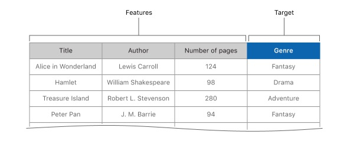

# 创建数据表以用来训练和评估
> 导入和格式化数据以创建和评估机器学习模型

## 概述

当你希望使用标准JSON或者CSV文件去创建一个模型,或者当你想要训练训练一个已经创建的模型时,请用一张表来存储训练数据.每一行都包含你正在训练模型正在分类的示例数据.<br>

在你的代码中你使用数据训练一个模型的重点在于,选择一列作为机器学习模型预测的目标,其余的列包含你提供给模型以进行预测的数据.下图说明了如何为能够预测书籍流派的分类模型构建训练数据.
<div align="center"></div>

当你根据一个CSV文件或者JSON文件创建一个`MLDataTable`时,`Create ML`库会将你输入的数据直接翻译成列表数据.

## 导入JSON数据
若要根据JSON数据创建一张数据表,你需要使用`init(contentsOf:)`初始化方法为每在根JSON数组中的字典创建一行.每个字典中的键名用作表中列的名称.
```
/*
 JSON file:
 [
   {
     "title": "Alice in Wonderland",
     "author": "Lewis Carroll",
     "pageCount": 124,
     "genre": "Fantasy"
   }, {
     "title": "Hamlet",
     "author": "William Shakespeare",
     "pageCount": 98,
     "genre": "Drama"
   }, ...
 ]
 */

let bookTable = try MLDataTable(contentsOf: URL(fileURLWithPath: "books.json"))
```

## 导入列表数据

或者, `MLDataTable` 可以从内存中的字典或 CSV 文件中导入数据。CSV 或逗号分隔的值文件是表的文本表示形式。您可以以编程方式创建 CSV 文件, 或者使用类似Numbers的应用程序导出电子表格。这些格式直接将数据表转换为行和列。<br>

例如,`init(dictionary:)`初始化方法用字典中的键作为列名,每个键的值作是该列值的数组.你可以使用 `MLDataValue` 表示一列值, 或任何符合 `MLDataValueConvertible` 协议的类型。
```
let data: [String: MLDataValueConvertible] = [
    "title": ["Alice in Wonderland", "Hamlet", "Treasure Island", "Peter Pan"],
    "author": ["Lewis Carroll", "William Shakespeare", "Robert L. Stevenson", "J. M. Barrie"],
    "pageCount": [124, 98, 280, 94],
    "genre": ["Fantasy", "Drama", "Adventure", "Fantasy"]
]

let bookTable = try MLDataTable(dictionary: data)
```
当你使用`init(contentsOf:)`初始化方法导入CSV文件时,它会根据CSV文件中的每一行在表中创建一行.
```
/*
 CSV file:
   title,author,pageCount,genre
   Alice in Wonderland,Lewis Carroll,124,Fantasy
   Hamlet,William Shakespeare,98,Drama
   Treasure Island,Robert L. Stevenson,280,Adventure
   Peter Pan,J. M. Barrie,94,Fantasy
 */

let bookTable = try MLDataTable(contentsOf: URL(fileURLWithPath: "books.csv")) 
```


