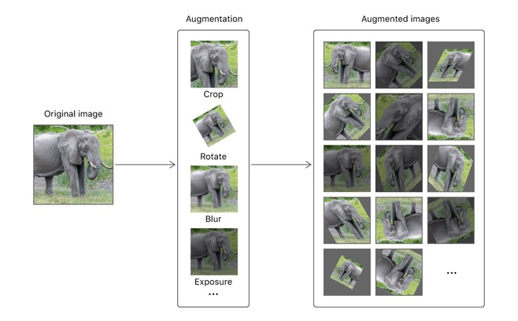

# 提高模型的准确性
> 利用指标调整机器学习模型的性能
## 概述
评估和改进你的模型首先要查看其在不同数据集上的性能。每个数据集的度量指标都告知哪些更改对模型的准确性影响最大。<br>

没有一个单独的指标能告诉你有关模型性能的一切信息.你可以在训练,评估和测试数据集之间比较度量值(`MLClassifierMetrics`或者`MLRegressorMetrics`,这取决于你的模型类型).例如,在`创建一个图片分类模型`一文中讨论的准确性就是从每个数据集的`classificationError`指标中提取的.<br>

在创建模型和加载完测试数据,你也可以通过代码访问这些值.
```
print("Training Metrics\n", model.trainingMetrics)
print("Validation Metrics\n", model.validationMetrics)

let evaluationMetrics = model.evaluation(on: testData)
print("Evaluation Metrics\n", evaluationMetrics)
```
通过这种方式,你可以看到各种不同指标的输出,包括针对分类器的`classificationError`,`precisionRecall`和`confusion`,以及针对回归变量的`maximumError`和`rootMeanSquaredError`.利用每个数据集的这些指标决定你的模型哪些地方可以提升.

## 提升模型的训练准确性
如果你对模型的训练准确性较低,则表明你当前的模型配置无法捕获数据的复杂性.<br>
尝试调整训练参数.当使用这些数据时,在`MLImageClassifierBuilder`plaground中加倍最大迭代次数(默认值是10).
<div align="center"></div>
针对自然语言数据,尝试不同的底层算法(参考`MLTextClassifier.ModelAlgorithmType`).对于更多常规的任务,使用不同的由`MLClassifier`或者`MLRegressor`创建的基础类型.

## 提升模型的验证准确性
在你每次训练模型时,如果你的模型的验证准确性很低或者忽高忽低,那么你需要更多的数据.你可以从你搜集的例子中创建更多的输入数据,这种技术被称为数据增强.对图片数据来说,你可以结合裁剪,旋转,模糊,曝光调整等操作,使一张图片变成很多样本.
<div align="center"></div>

也有可能你有大量的数据,但是验证准确性仍然远远低于你的训练准确性.对于这种情况,你的模型是过度拟合的(过犹不及),意思是它正在学习太多有关你训练数据的详细信息,通常情况这些信息不适用于其他实例.针对这种情况,你需要减少训练迭代次数,避免模型学习太多有关训练的数据.

## 提升模型的评估准确性
如果你的模型关于测试数据的准确性比测试和验证的准确性低,这通常表明在你训练的数据和用来评估的测试数据之间存在有意义的差别.<br>
例如,试想你用很多室内的猫的图片训练你的`MLImageClassifier`模型,但是后来用室外猫的图片做测试.因为在光线,曝光和背景方面有很大区别,所以你的测试数据不太可能产生好的结果.在没有足够的训练数据的情况下, 对于模型来说, 对人类来说似乎显而易见的图像之间的差异是很难解决的。<br>

为此,在训练过程中提供更多的不同数据.通常来说,更多的样本会带来更高的性能.但是显示你模型的样本和你测试的数据的一致性也很重要.


