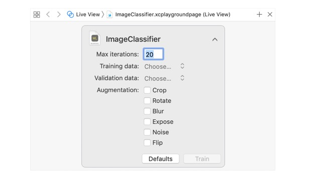

# 提高模型的准确性
> 利用指标调整机器学习模型的性能
## 概述
评估和改进你的模型首先要查看其在不同数据集上的性能。每个数据集的度量指标都告知哪些更改对模型的准确性影响最大。<br>

没有一个单独的指标能告诉你有关模型性能的一切信息.你可以在训练,评估和测试数据集之间比较度量值(`MLClassifierMetrics`或者`MLRegressorMetrics`,这取决于你的模型类型).例如,在`创建一个图片分类模型`一文中讨论的准确性就是从每个数据集的`classificationError`指标中提取的.<br>

在创建模型和加载完测试数据,你也可以通过代码访问这些值.
```
print("Training Metrics\n", model.trainingMetrics)
print("Validation Metrics\n", model.validationMetrics)

let evaluationMetrics = model.evaluation(on: testData)
print("Evaluation Metrics\n", evaluationMetrics)
```
通过这种方式,你可以看到各种不同指标的输出,包括针对分类器的`classificationError`,`precisionRecall`和`confusion`,以及针对回归变量的`maximumError`和`rootMeanSquaredError`.利用每个数据集的这些指标决定你的模型哪些地方可以提升.

## 提升模型的训练准确性
如果你对模型的训练准确性较低,则表明你当前的模型配置无法捕获数据的复杂性.<br>
尝试调整训练参数.当使用这些数据时,在`MLImageClassifierBuilder`plaground中加倍最大迭代次数(默认值是10).
<div align="center"></div>
针对自然语言数据,尝试不同的底层算法(参考`MLTextClassifier.ModelAlgorithmType`).对于更多常规的任务,使用不同的由`MLClassifier`或者`MLRegressor`创建的基础类型.


