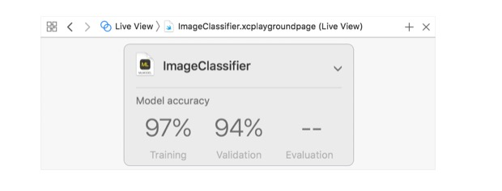
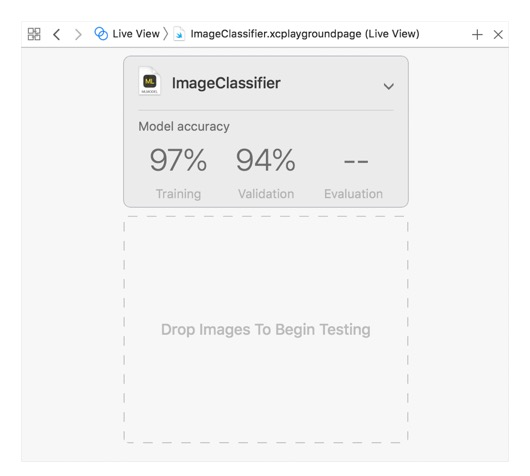
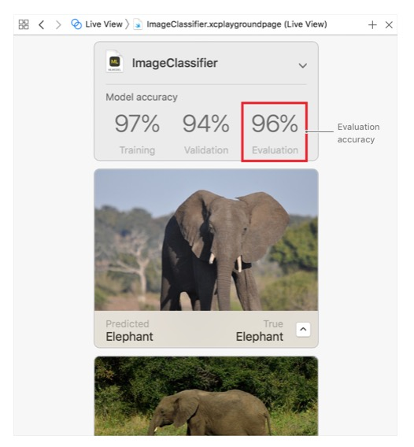
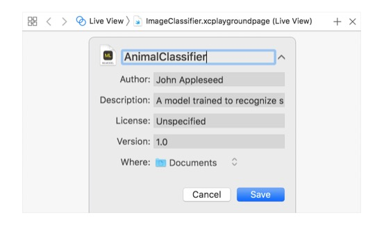
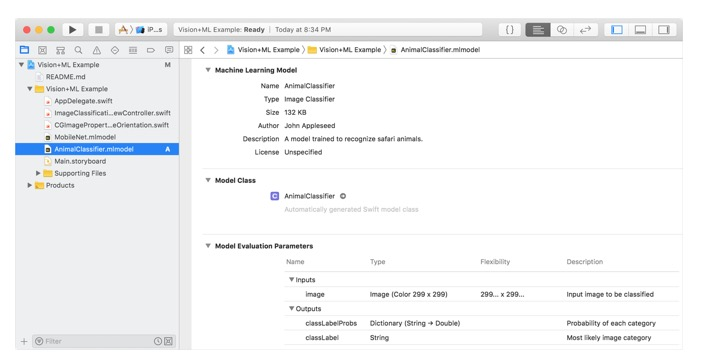

# 创建一个图片分类模型
训练一个机器学习模型来分类图片
## 概述
image classifier是一个经过图像识别训练的机器学习模型.当提供一张图片给它时,它会给那张图片打上一个标签.
<div align="center"></div>

你可以通过提供大量的你已经打了标签的图片样本来训练一个图像分类模型.例如,你可以通过提供大量的大象图片,长颈鹿图片,狮子图片等等来训练image classifier去识别动物.
<div align="center"></div>

## 准备数据
要训练和评估分类模型,你首先应当准备好将要用到的数据.从大约80%的你已经打过标签的图像中创建一个训练数据集.从剩余的图像中创建测试数据集.一定要确保提供的图像只能出现在上述其中一个集合.

接下来,组织你的数据以兼容`MLImageClassifier.DataSource`类型中的一种.一种实现的方法是创建一个文件夹,命名为`Training Data`,再创建一个文件夹,命名为`Testing Data`.每一个文件夹里,创建子文件夹,并以图片的标签命名.然后将图像分别放入每个数据集相应的子文件夹.
<div align="center"></div>

确切的标签字符串并不是很重要,只要对于你易于理解即可.例如,对于所有的猎豹图像,你都可以用标签`Cheetah`(猎豹).您不必以任何特定方式命名图像文件, 也不必向它们添加元数据。你只需将它们放入正确标签的文件夹.

对于训练集合,每个标签至少需要10张图片,当然,通常来说越多越好.同时,每个标签图片的数量应该保持平衡.例如,不能对于`Cheetah`用了10张,而`Elephant`(大象)用了1000张.

图片可以是任何符合公共图片文件类型标识的格式.包括比较通用的格式,如JPEG和PNG.尽管最好使用至少299X299像素的图像,但这些图片没必要彼此大小相同,也没必要是任何特定的大小,如果可能的话,用收集的图片以一种类似图片如何被收集的方式训练用以预测.

提供多样化的图片.例如,使用多角度,不同光线条件展示动物的图片.对于一个给定标签的几乎相同的图像进行训练的分类模型往往比在更多样的图像集上训练的性能较差。

>提示:分类模型使用场景打印特征提取器来加速训练进程.这会影响适合训练的图像种类.更多详情,参考[MLImageClassifier.FeatureExtractorType.scenePrint(revision:)]()

## 在Playground中展示一个图片分类模型创建者
随着你的数据准备就绪,以一个macOS target创建一个新的Xcode playground.用该playground创建一个` MLImageClassifierBuilder`实例并在live view中展示.

```
// Import CreateMLUI to train the image classifier in the UI.
// For other Create ML tasks, import CreateML instead.
import CreateMLUI 

let builder = MLImageClassifierBuilder()
builder.showInLiveView()
```

在Xcode中打开助手编辑器,然后运行playground.然后live view就会呈现出一个`image classifier`(图片分类模型)
<div align="center"></div>

## 训练图片分类模型
将你的训练数据文件夹拖入到live view的指定位置.当你这样做时,训练进程就开始了,并且该模型会展示训练进度.
<div align="center"></div>

在训练过程中,图片分类模型会自动地将训练数据分为一个训练集合和一个验证集合.这两个集合都会影响训练,但是是以不同的方式.因为这种数据区分是随机的,你每次训练该模型,可能都会得到不同的结果.
当训练结束,live view会展示训练和验证的准确性.这代表了受训模型从特定的数据集合中区分图像的好坏.由于模型是通过这些图片训练的,所以通常会区分的很好.
<div align="center"></div>

## 评估模型的表现
接下来,通过用该模型没有见过的图片测试,以评估受训模型的表现.你可以用训练之前创建的测试数据集来做这件事.将测试数据文件夹拖到live view,就像训练时所做的那样.
<div align="center"></div>

该模型处理所有的图像, 对每一个进行预测。因为这是标记的数据, 所以模型可以检查自己的预测。然后, 它将总体评估准确性作为 UI 中的最终度量值添加。
<div align="center"></div>

如果评估表现不是很好,你可能就需要用更多的数据进行重新训练了,例如,通过引入图像增强或者改变其他训练配置.有关如何进行更详细的模型评估,以及改进模型性能的策略的信息, 请参阅[提高模型的准确性]()。

## 保存Core ML模型
当你的模型表现足够好,保存下来,以至于在你的app中应用.
给模型取一个有意义的名字.将默认的`ImageClassifier`改为`AnimalClassifier`,你可以添加更过有关模型的信息,比如作者和简单的描述.点击三角箭头以这些元数据字段并填写详细信息.
<div align="center"></div>
点击保存,模型就会以`.mlmodel`格式将文件写入`Where`字段指定的目录中.

## 将模型添加进你的App
现在将训练过的模型添加进有`Core ML`存在的app.你可以用这个模型替换`Classifying Images with Vision and Core ML`样例代码项目中的模型.样例APP会像之前一样运行,只不过它会根据你定义的标签识别和区分动物.
打开样例代码工程,将模型拖进去,添加完成后,Xcode会展示模型的元数据,以及其他信息.
<div align="center"></div>

要在项目中用新模型,只需改一句代码.项目附带的`MobileNet`模型恰好在`ImageClassificationViewController`类的一处实例化:
```
let model = try VNCoreMLModel(for: MobileNet().model)
```
更改这句代码,用新模型类替换:
```
let model = try VNCoreMLModel(for: AnimalClassifier().model)
```
这些模型是可互换的, 因为两者都以图像作为输入和输出标签。替换之后, 示例应用程序会像以前一样对图像进行分类, 只不过它使用了你的模型及其关联的标签。

## 自动化创建图片分类模型
正如以上所说,你可以使用`MLImageClassifierBuilder`实例以非常少的代码和机器学习锻炼来训练一个有用的图片分类模型.但是,如果需要编写训练模型过程的脚本,请改用`MLImageClassifier`实例.步骤本质上是一样的:准备数据,训练模型,评估表现以及将结果保存成`Core ML`model 文件.不同的是,以编程的方式做这些.例如,你初始化一个`MLImageClassifier.DataSource`实例并且将它提供给模型的`evaluation(on:)`方法,以替代将测试数据拖进live view去评估模型的表现的操作.

