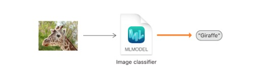
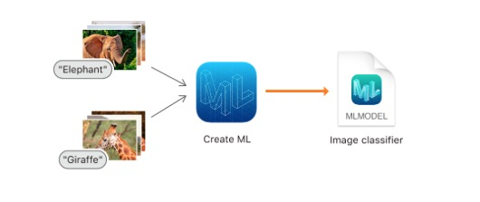
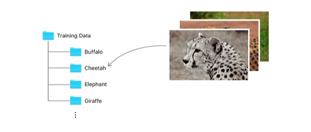
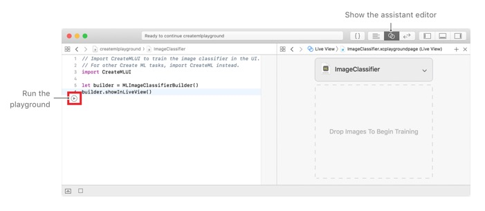
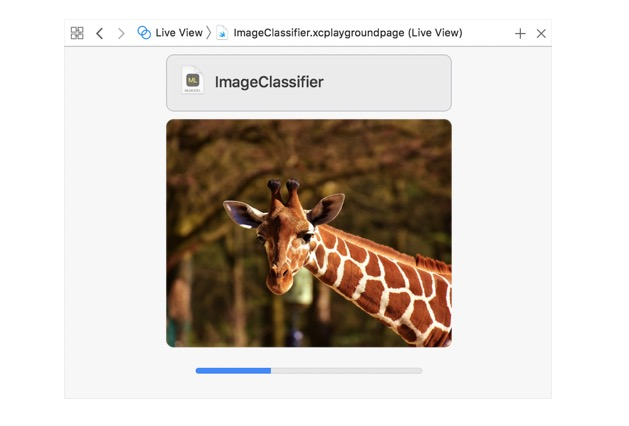

# 创建一个图片分类模型
训练一个机器学习模型来分类图片
## 概述
image classifier是一个经过图像识别训练的机器学习模型.当提供一张图片给它时,它会给那张图片打上一个标签.
<div align="center"></div>

你可以通过提供大量的你已经打了标签的图片样本来训练一个图像分类模型.例如,你可以通过提供大量的大象图片,长颈鹿图片,狮子图片等等来训练image classifier去识别动物.
<div align="center"></div>

## 准备数据
要训练和评估分类模型,你首先应当准备好将要用到的数据.从大约80%的你已经打过标签的图像中创建一个训练数据集.从剩余的图像中创建测试数据集.一定要确保提供的图像只能出现在上述其中一个集合.

接下来,组织你的数据以兼容`MLImageClassifier.DataSource`类型中的一种.一种实现的方法是创建一个文件夹,命名为`Training Data`,再创建一个文件夹,命名为`Testing Data`.每一个文件夹里,创建子文件夹,并以图片的标签命名.然后将图像分别放入每个数据集相应的子文件夹.
<div align="center"></div>

确切的标签字符串并不是很重要,只要对于你易于理解即可.例如,对于所有的猎豹图像,你都可以用标签`Cheetah`(猎豹).您不必以任何特定方式命名图像文件, 也不必向它们添加元数据。你只需将它们放入正确标签的文件夹.

对于训练集合,每个标签至少需要10张图片,当然,通常来说越多越好.同时,每个标签图片的数量应该保持平衡.例如,不能对于`Cheetah`用了10张,而`Elephant`(大象)用了1000张.

图片可以是任何符合公共图片文件类型标识的格式.包括比较通用的格式,如JPEG和PNG.尽管最好使用至少299X299像素的图像,但这些图片没必要彼此大小相同,也没必要是任何特定的大小,如果可能的话,用收集的图片以一种类似图片如何被收集的方式训练用以预测.

提供多样化的图片.例如,使用多角度,不同光线条件展示动物的图片.对于一个给定标签的几乎相同的图像进行训练的分类模型往往比在更多样的图像集上训练的性能较差。

>提示:分类模型使用场景打印特征提取器来加速训练进程.这会影响适合训练的图像种类.更多详情,参考` MLImageClassifier.FeatureExtractorType.scenePrint(revision:)`.(这是一个训练上百万张图片的特征提取器)

## 在Playground中展示一个图片分类模型创建者
随着你的数据准备就绪,以一个macOS target创建一个新的Xcode playground.用该playground创建一个` MLImageClassifierBuilder`实例并在live view中展示.

```
// Import CreateMLUI to train the image classifier in the UI.
// For other Create ML tasks, import CreateML instead.
import CreateMLUI 

let builder = MLImageClassifierBuilder()
builder.showInLiveView()
```

在Xcode中打开助手编辑器,然后运行playground.然后live view就会呈现出一个`image classifier`(图片分类模型)
<div align="center"></div>

## 训练图片分类模型
将你的训练数据文件夹拖入到live view的指定位置.当你这样做时,训练进程就开始了,并且该模型会展示训练进度.
<div align="center"></div>


