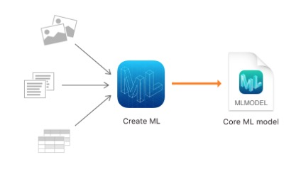

# 创建机器学习模型
在苹果提供的众多库中,我们可以使用Create ML去创建和训练自定义的机器学习模型.我们可以训练模型去完成一些任务,比如图片识别,从文本中提取语义,以及查找数字之间的关系. 

我们可以通过展示典型的样本,来训练模型识别样本,例如,我们可以通过展示各种各样狗的图片,来训练模型识别出狗.当训练完成后,我们就可以向其展示它没有见过的图片来进行测试,以评估模型的表现.当模型的表现足够好,能够达到我们的需求时,我们就可以通过Core ML将其整合进我们的app了. 
 
Create ML利用了苹果产品中内置的机器学习基础设施, 如照片和 Siri。这意味着我们的图像分类和自然语言模型更小, 并花费更少的时间来训练。
